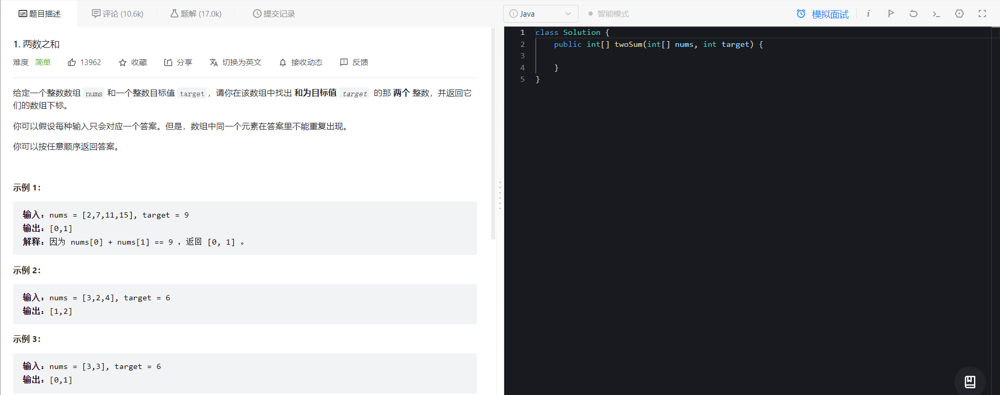
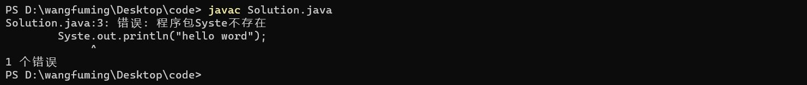

核心功能

能够管理题目：保存很多题目信息（后端）

题目列表页：展示题目列表（前端）

题目详情页：题目信息+代码编辑框（前端）

提交并运行（后端）

查看运行结果（前端）

# 功能分析

## 题目管理

分析：

这个项目是一个在线OJ系统，那么就需要仿造当前最知名的OJ平台-LeetCode

打开力扣题目界面


我们可以看见，显示很多题目,包含的主要信息是，题目序号，题目名字，题目难度

点击某个题目时，查看详情。



显示的主要是信息是：题目的描述，以及部分测试样例，在右边有一个代码编辑框。

对于一个完成的题目而言，它需要有

```sql
create table problem(
    id int primary key auto_increment, --  自增主键
    title varchar(50) not null,        --  题目名字
	level varchar(50) not null,        --  题目难度
    description varchar(4096) not null,--  题目描述
    templateCode varchar(4096) not null,-- 模板代码
    testCode varchar(4096) not null     -- 测试用例
    )
```

在数据库上面的操作

**新增题目**

**修改题目**

上述功能不暴漏给普通用户，用于管理员管理题目信息。

**查看题目列表**

在LeetCode中我们看见题目是50条每页，但是我们是小OJ平台，暂时不考虑分页的功能

题目列表的显示信息主要是：id，名字，难度

对数据库操作将三个信息加入实体类，然后线性表返回给前端

**查看题目详情**

通过id查看一个题目的具体信息，这时候要查询所有的信息让后分装实体类返回给前端

# 编译运行模块

在初学java是通过`javac`编译文件，通过`java`执行文件

比如在文件上建立一个简单的.java文件，并通过命令运行

```java
public class Solution{
    public static void main(String[] args){
        System.out.println("hello word");
    }
}
```

直接在当前文件夹进行编译运行


将文件编译到其他文件，然后指定文件路径进行运行


修改代码为

```java
public class Solution{
    public static void main(String[] args){
        Syste.out.println("hello word");
    }
}
```



修改代码为

```java
public class Solution{
    public static void main(String[] args){
        System.out.println("hello word");
        int a=10/0;
    }
}
```


由上面编译或者执行的反馈信息进行判断程序是否正常。

通过标准输入输出得到`javac`或者`java`得到信息，然后写入文件中进行处理。

我们主要通过

```java
public void run(String cmd,String stdoutFile,String stderrFile){
    Process process = Runtime.getRuntime().exec(cmd);
    //对文件的操作
}
```

执行命令然后得到标准的输入输出反馈

有了对文件的操作，那我们需要文件，文件怎么得到呢？仿造leetcode，我们得到前端来的代码进行生成文件的操作。

需要一个一个实体类来放置代码。不妨叫它问题

```java
public class Question{
    private String code;
    //set和get方法
}
```

同理，也需要一个实例类来返回编译运行信息。编译异常、运行正常、运行异常。如果异常还要返回信息。

```java
public class Answer{
    //错误码
    private int error;
    //错误信息
    private String reason;
    //标准输出结果
    private String stdout;
    //标准错误结果
    private String stderr;
    //set和set方法
}
```

