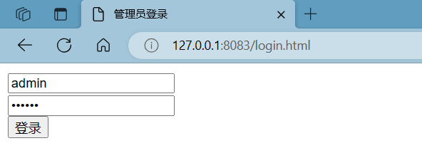

数据库使用说明

数据库题目文件存储在`problemMsg`文件夹中，通过进入`ip:8083/login.html`登录进行文件操作，录入数据库


1、创建数据库

```sql
create database online_oj;
use online_oj;
```

创建表，表中的字段和`model`文件下的类`Problem`，`User`，`Time`相对应

```sql
create table problem(
    id int primary key auto_increment, --  自增主键
    title varchar(50) not null,        --  题目名字
	level varchar(50) not null,        --  题目难度
    description varchar(4096) not null,--  题目描述
    templateCode varchar(4096) not null,-- 模板代码
    testCode varchar(4096) not null     -- 测试用例
    )
create table user(
	name varchar(20),
    password varchar(20)
)
create table time(
	id int,
    duration int,
    cnt int
)
```

为管理员手动插入一条数据

```sql
insert user values ("admin","123456")
```

2、导入数据

启动项目

进入`http://127.0.0.1:8083/login.html`，如果在远程服务器登录或者修改了端口号记得修改



输入账号密码登入进去


输入上传题目id导入题目，对题目文件进行修改后输入修改题目进行更新

3、修改数据

由于记录时间和排名的功能是后续增加的，部分数据没有修正，在输入正确答案后会提示

`题目超时`的相关信息

对题目1和题目2中`testCode`中的main函数的

```Java
	System.out.println("Time:"+(end-begin));
```

修改为

```Java
	System.out.println("Program running time is "+(end-begin)+ " ms");
```

题目3，main函数没有增加计算时间的代码可参照题目4中的代码进行处理

